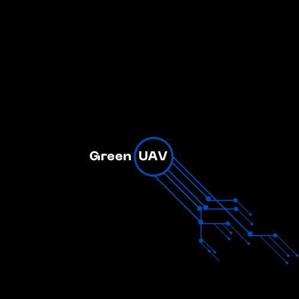

# GreenUAV - microcontrollerENV Flight Control FW 

GreenUAV is a flight control firmware written in C/C++ for Unmanned Aerial Vehicles (UAVs), designed to explore the realms of UAV autonomy, control logic, sensors, actuators, and safety measures in aerial robotics.

## Features

- **Autonomous Flight Control:** Implement advanced control algorithms to achieve stable and precise flight.
- **Sensor Integration:** Integrate various sensors like accelerometers, gyroscopes, and altimeters for accurate data processing.
- **Actuator Control:** Develop control strategies for actuators, such as servos, motors, and thrusters.
- **Flight Modes:** Support multiple flight modes, from manual control to fully autonomous operation.
- **Safety Mechanisms:** Implement fault detection and recovery procedures to ensure safe operation.
- **Communication Interfaces:** Integrate communication protocols to exchange data with ground stations and telemetry systems.

## Getting Started

1. Clone this repository to your local machine.
2. Set up your development environment (e.g., IDE, compiler).
3. Customize and extend the firmware to suit your UAV's requirements.
4. Compile and deploy the firmware to your UAV platform.

## Directory Structure

- `src/`: Contains the source code for the flight control firmware.
- `include/`: Includes header files for the firmware components.
- `config/`: Holds configuration files and settings.
- `tests/`: Houses test scripts and scenarios for verification.
- `docs/`: Documentation, including user guides and development notes.

## Contributing

Contributions are welcome! Whether you're a developer, designer, or UAV enthusiast, you can help us enhance GreenUAV. Please read our [Contribution Guidelines](CONTRIBUTING.md) before getting started.

## License

GreenUAV is open-source software released under the [MIT License](LICENSE). Feel free to use, modify, and distribute the code for both personal and commercial purposes.

## Contact

For questions, suggestions, or collaborations, reach out to zbourmada@gmail.com or open an issue here on GitHub.

